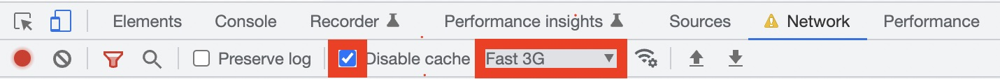

<h1>React-progressive-image</h1>


## Short description:

<p align="Left"> A solution for image preloading on react. Use slow internet emulation in DevTools.

For greater clarity:

- Open DevTools in your browser (Google Chrome, for example)
- Go to "Network" tab
- Select 'Fast 3G'
- Activate 'Disable cache'
- Reload the page (cmd + R), wait for the images to appear and deactivate 'Disable cashe' back while images are loading (it's necessary for demonstration only)

[Open in a browser](https://progressiveimage.vercel.app/)
<br>

## Technologies:

- React.js (CRA)
- TypeScript

## Languages:

- HTML
- CSS
- TypeScript
- JSX

## You will need git, Node JS

- [How to install git.](https://git-scm.com/book/en/v2/Getting-Started-Installing-Git)
- [How to install NodeJS.](https://nodejs.org/en/download/package-manager/)

## Install the project:

In the command line, navigate to the folder where the project will be deployed. Then copy it from GitHub:

```sh
`$ git clone git@github.com:RoChernikov/react-progressive-image.git`
```

Next, go to the project folder and install the components:

```sh
`$ npm install`
```

Then you can run the project on a local server:

```sh
`$ npm start`
```

## Links:

- [Deploy](https://progressiveimage.vercel.app/)

- [For issues of improvement](https://t.me/ro_runner)
